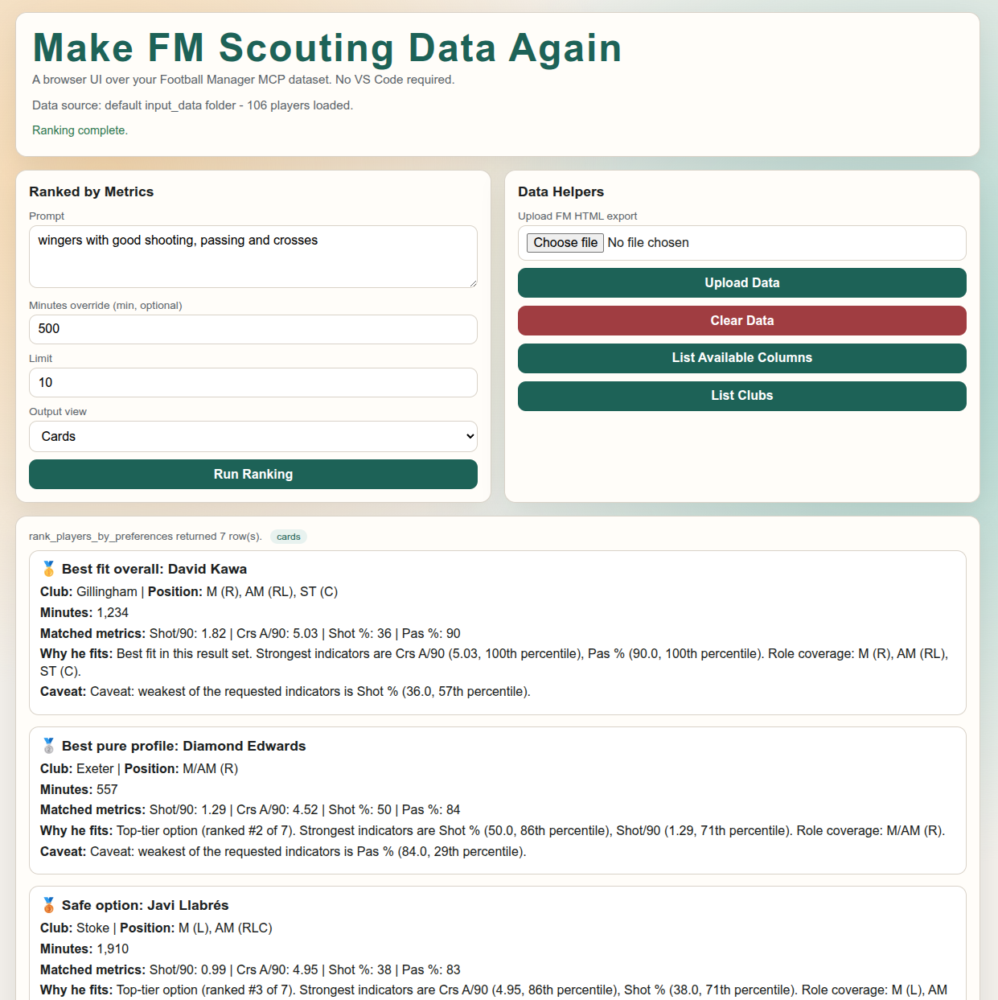
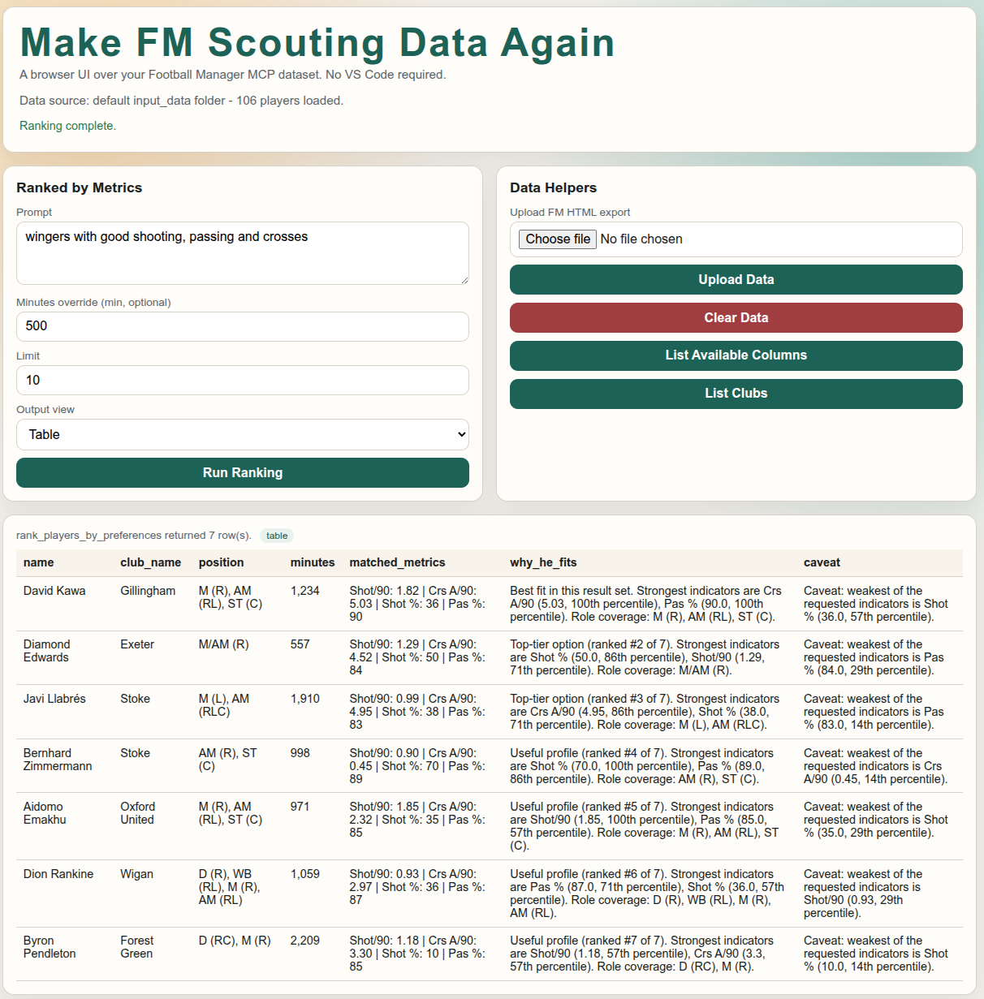

# football-manager-data-mcp

A Python MCP server that lets you query Football Manager player data using
natural-language prompts. Ask questions like *"find me a wing back with high
crosses per 90 and progressive passes"* or *"show me strikers with high xG and
shot accuracy"* directly from Copilot Chat or any MCP-compatible AI client.

---

## Prerequisites

- [uv](https://docs.astral.sh/uv/getting-started/installation/) (Python package manager)
- Python 3.12+
- Football Manager 2024 (to export player data)
- VS Code with GitHub Copilot Chat (or another MCP client)

---

## Step 1 — Export players from Football Manager

The server reads HTML exports generated by Football Manager's player search screen.

1. Open Football Manager.
2. Go to **Scouting → Players** (or any squad/search view).
3. Load the custom view file from the `fm_views/` folder in this repo:
   - `fm_views/General Metrics search.fmf`
   - In FM, use **Views → Load View** and select this file. It configures the
     exact columns the server expects.
4. Filter/sort players however you like (by league, position, etc.).
5. Select all players (`Ctrl+A`), then go to
   **Right-click → Export → Web Page (HTML)**.
6. Save the exported `.html` file into the `input_data/` folder in this repo.
   You can export multiple files — the server merges all of them.

> The `fm_views/General Metrics search.fmf` view includes these columns:
> `Mins`, `Gls`, `Ast`, `Tck/90`, `Tck R`, `Hdrs W/90`, `Hdr %`, `Int/90`,
> `Poss Won/90`, `Poss Lost/90`, `Pres C/90`, `Pres A/90`, `Pas %`,
> `Pr passes/90`, `Crs A/90`, `Cr C/A`, `K Ps/90`, `OP-KP/90`, `xA/90`,
> `Drb/90`, `Shot/90`, `Shot %`, `xG/90`, `Gls/90`, `Transfer Value`.

---

## Step 2 — Set up the server

```bash
git clone <repo-url>
cd football-manager-data-mcp
make setup
```

This creates a local `.env` (from `.env.example` if missing), installs all
dependencies, and configures pre-commit hooks.

To recreate `.env` manually at any time:

```bash
make environment
```

The UI backend auto-loads `.env` at runtime, so you do not need to run
`source .env` manually.

To auto-configure local LLM defaults (Ollama + model + `.env` values):

```bash
make local-llm
```

---

## Step 3 — Configure VS Code

Create or open `.vscode/mcp.json` in this workspace and add:

```json
{
  "servers": {
    "football-manager-data": {
      "type": "stdio",
      "command": "uv",
      "args": ["run", "football-manager-data-mcp"],
      "cwd": "/absolute/path/to/football-manager-data-mcp"
    }
  }
}
```

Then reload VS Code (`Ctrl+Shift+P` → `Developer: Reload Window`).

---

## Step 4 — Use the tools in Copilot Chat

1. Open **Copilot Chat** and switch to **Agent** mode.
2. Click the **Tools** icon and confirm `football-manager-data` is listed.
3. Ask natural-language questions, for example:

   - *"Find me strikers with high xG per 90 and high shot accuracy"*
   - *"Show me wing backs with high crosses attempted per 90 and progressive passes"*
   - *"Tell me attacking midfielders with the best pass completion"*
   - *"Find a false nine with a high goals per 90"*
   - *"List all available columns"*

### Available tools

| Tool | Description |
|---|---|
| `rank_players_by_preferences` | Rank players by one or more metrics from a natural-language prompt. Supports role names (e.g. "wing back", "mezzala", "false nine") and metric phrases (e.g. "high xG per 90"). |
| `list_available_columns` | List all columns parsed from your export and whether each is numeric/queryable. |
| `search_players` | Search by player name, club, or position fragment. |
| `get_player_profile` | Return the full stat profile for a player by ID. |
| `list_clubs` | List all clubs present in the loaded data. |
| `get_club_squad` | Return all players for a given club. |

---

## Refreshing data

1. Export a new HTML file from FM (see Step 1).
2. Drop it into `input_data/` (replacing or adding alongside existing files).
3. Restart the MCP server: `Ctrl+Shift+P` → `MCP: List Servers` → select server → `Restart`.

The `input_data/` folder is gitignored so your personal saves are never committed.

---

## Development

```bash
make check    # lock validation + lint + format check + tests
make test     # run tests only
make lint     # ruff lint with auto-fix
make format   # ruff format
make run      # start the server manually over stdio
make run-ui   # start browser UI at http://127.0.0.1:8000
make local-llm # configure local LLM defaults in .env
make lock     # refresh uv.lock
```

## Browser UI (No VS Code Required)

You can run a simple web UI over the same `FootballCatalog` data and tools.

1. Make sure your FM exports are in `input_data/`.
2. Install dependencies:

```bash
make setup
```

3. Start the UI server:

```bash
make run-ui
```

4. Open your browser at:

```text
http://127.0.0.1:8000
```

The page includes:

- `Ranked by Metrics` (maps to `rank_players_by_preferences`)
- Output view toggle (`Cards` or `Table`)
- `List Available Columns`
- `List Clubs`
- `Upload Data` (upload your own FM HTML export with the expected columns)
- `Clear Data` (removes uploaded UI files so storage does not keep growing)

Ranked results now include tailored `why_fit`, `caveat`, and `tactical_use` notes per player.
By default, the UI backend attempts an LLM rewrite for more natural wording and falls back to
rule-based explanations if no LLM is available.

This UI uses the same parsing/ranking logic as the MCP server, so results stay consistent.

### Uploading Your Own HTML In The Browser UI

1. Click `Choose file` in `Data Helpers` and select your FM `.html` export.
2. Click `Upload Data`.
3. The UI switches to the uploaded dataset for all queries.
4. Click `Clear Data` to remove uploaded files and switch back to default `input_data/` files.

### LLM Explanations (Default: On)

The UI rank endpoint uses a hybrid approach:

1. Deterministic fact extraction (metrics, percentiles, trade-off)
2. LLM rewrite of those facts into natural-language scouting notes
3. Automatic fallback to deterministic text if LLM is unavailable

Environment variables:

- `FM_ENABLE_LLM_EXPLANATIONS=true` (default)
- `FM_LLM_MODEL=qwen2.5:7b-instruct` (default)
- `FM_LLM_BASE_URL=http://127.0.0.1:11434/v1` (default)
- `FM_LLM_API_KEY=local-dev` (default for local providers)

Legacy `OPENAI_API_KEY` and `OPENAI_BASE_URL` are still accepted for backward
compatibility.

Use `make environment` to generate `.env` from `.env.example` if you do not
already have one.

## Example Searches

### 1) Wingers: shooting, passing and crossing table view

- Prompt: `wingers with high cross and progressive passes`



### 2) Wingers: shooting, passing and crossing table view

- Prompt: `wingers with high cross and progressive passes`



---

## AWS Deployment (EC2 + Terraform + GitHub Actions)

This repository includes a module-based Terraform stack and an SSH deployment workflow:

- Terraform root: `terraform/`
- Local module wrapper: `terraform/modules/compute/`
- Deploy workflow: `.github/workflows/deploy-ui-aws.yml`

### Required GitHub Secrets

Use the same AWS credential naming convention as your existing static-site repo:

- `TF_VAR_ACCESS_KEY`
- `TF_VAR_SECRET_KEY`
- `TF_VAR_SSH_KEY_NAME` (existing EC2 key pair name)
- `EC2_SSH_PRIVATE_KEY` (private key matching the key pair above)
- `EC2_USER` (e.g. `ec2-user` for Amazon Linux)

Runtime app secrets for LLM access:

- `APP_FM_ENABLE_LLM_EXPLANATIONS`
- `APP_FM_LLM_MODEL`
- `APP_FM_LLM_BASE_URL` (for Groq: `https://api.groq.com/openai/v1`)
- `APP_FM_LLM_API_KEY`

Optional:

- `EC2_HOST` to override Terraform output host selection
- `TF_VAR_SSH_ALLOWED_CIDR` to constrain SSH source IP range

### Runtime Behavior

- Container binds on `0.0.0.0:8000` and is mapped to EC2 port `80`.
- Health check endpoint is available at `/health`.
- Uploaded UI files are ephemeral and auto-cleared hourly by default.

### Manual Terraform Run

```bash
cd terraform
terraform init
terraform validate
terraform plan -var='ssh_key_name=<your-key-name>'
terraform apply -var='ssh_key_name=<your-key-name>'
```

### Access URL

After apply/deploy, open:

- `http://<EC2_PUBLIC_DNS>`
- or `http://<EC2_PUBLIC_IP>`

---

## Project Structure

```text
.
├── fm_views/
│   └── General Metrics search.fmf   # FM view file — load this in-game before exporting
├── example_data/                     # Reference export showing expected column format
├── input_data/                       # Your FM exports go here (gitignored)
├── src/
│   ├── football_manager_data_mcp/
│   │   ├── catalog.py                # Data loading, parsing, and ranking logic
│   │   └── server.py                 # MCP tool definitions
│   └── test/
│       └── test_catalog.py
├── .vscode/
│   └── mcp.json                      # VS Code MCP server config
├── pyproject.toml
├── Makefile
└── Dockerfile
```
